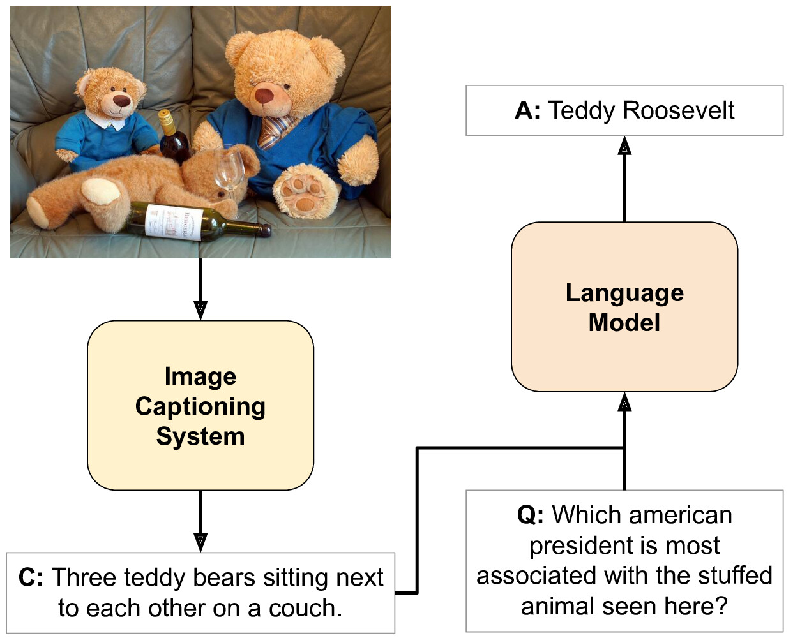

# Caption Based Model

This is the official PyTorch package for the CBM Model described in [Image Captioning for Effective Use of Language Models in Knowledge-Based Visual Question Answering](https://arxiv.org/abs/2109.08029).




## Create Python Environment

Create a Python 3 environment using your favorite tool to set one. In the following example, we will use `venv`.

```
venv py_cbm                       # Create env
source py_cbm/bin/activate        # Load env

pip install -r requirements.txt   # Install dependencies
```


## Resources

Once the environment is ready, you can execute the following Python script to download and uncompress the needed data for our experiments.

```
python download_data.py --data_dir "./data"
```

Therefore, this script will download everything to the `data_dir` path. The script will automatically set this path to the default data folder for future experiments.  Once finished, you can check your specified folder and see the data is arranged in different subfolders:

* *Annotations*: Questions and annotations for OK-VQA and VQA datasets. Files for both versions of OK-VQA can be found there (v1.0 and v1.1).

* *Captions*: Captions of the images for both OK-VQA and VQA datasets. Human captions and automatically generated ones with [OSCAR](https://github.com/microsoft/Oscar) are included.

* *Splits*: Different splits that have been used for both datasets.

* *Vocab*: Answer vocabulary for both datasets, used to implement the classifier of $CBM_{BERT}$.


### Compute Visual Features

If you want to use $MM_{BERT}$, you need to generate visual features of COCO images yourself. In order to generate them, use the [MMF Framework](https://github.com/facebookresearch/mmf) and follow [this](https://mmf.sh/docs/tutorials/image_feature_extraction) tutorial to extract features from COCO images of both train2014 and val2014 splits. After you compute them, save the generated files inside "DATA_DIR/features/train2014" and "DATA_DIR/features/val2014" respectively.


## Training and Evaluation

You can replicate all of our experiments by calling the following two scripts. The first one fine-tunes BERT-like Transformer Encoders in different settings, whereas the second one specifically works for T5 models (Transformer Encoder-Decoder).

```
sh experiments/bert_experiments.sh "./output" 1
sh experiments/t5_experiments.sh "./output" 1
```

When calling these scripts, the first argument defines the output directory, whereas the second can be used as and ID or keyword that is appended to each run name.

Apart from those scripts, you can directly choose to train and evaluate specific models by checking all .py files in the "./src" folder:

* *bert_train.py*: Fine-tunes $Q_{BERT}$, $CBM_{BERT}$ or $MM_{BERT}$ on VQA or OK-VQA tasks.

* *bert_eval.py*: Evaluates $Q_{BERT}$, $CBM_{BERT}$ or $MM_{BERT}$ on VQA or OK-VQA tasks.

* *bert_eval_late_fusion.py*: Evaluates the result of mixing $CBM_{BERT}$ and $MM_{BERT}$ models' output probabilities on VQA or OK-VQA tasks.

* *t5_train.py*: Fine-tunes $CBM_{T5}$ on OK-VQA.

* *t5_eval.py*: Evaluates $CBM_{T5}$ on OK-VQA.

All input arguments are specified and described inside each file. 


### Examples

The following is an example to fine-tune a $CBM_{BERT}$ on VQA for 10k steps using automatically generated captions with OSCAR.

```
python src/bert_train.py --model "cbm" --dataset "vqa_v2" --cap_type "oscar" \
   --evaluate --max_steps 10000 --run_name "cbm_bert_oscar_vqa_v2"

```

The following is an example to fine-tune a $CBM_{T5}$ on OK-VQA for 20k steps with a batch size of 56 and learning-rate of 5e-5.

```
python3 src/t5_train.py --model "t5-base" --do_train --do_predict \
    --batch_size 56 --lr 5e-5 --max_steps 20000 --run_name "cbm_t5_oscar"
```


# Citation

If you use this repository in your work, please cite:

```
@article{SALABERRIA2023118669,
  title = {Image captioning for effective use of language models in knowledge-based visual question answering},
  journal = {Expert systemss with Applications},
  volume = {212},
  pages = {118669},
  year = {2023},
  issn = {0957-4174},
  doi = {https://doi.org/10.1016/j.eswa.2022.118669},
  url = {https://www.sciencedirect.com/science/article/pii/S0957417422017055},
  author = {Ander Salaberria and Gorka Azkune and Oier {Lopez de Lacalle} and Aitor Soroa and Eneko Agirre},
  keywords = {Visual question answering, Image captioning, Language models, Deep learning}
}
```
